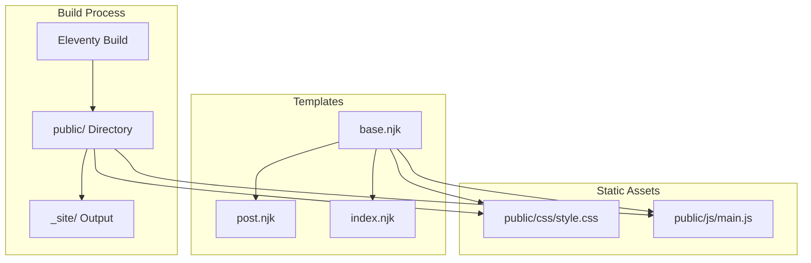

# Design Document: Blog Styling Feature

## Overview

This feature adds comprehensive CSS and JavaScript styling to transform the blog service from a basic unstyled site into a professional, modern, and responsive blog. The styling system provides a cohesive visual design with proper typography, spacing, color scheme, and responsive layouts that work across mobile, tablet, and desktop devices.

**Purpose**: This feature delivers a complete visual design system to the blog service, making it visually appealing, readable, and accessible to all users.

**Users**: Blog readers will benefit from improved readability, visual hierarchy, and responsive design. Content authors will see their posts displayed with professional styling.

**Impact**: Changes the current unstyled HTML structure by adding CSS stylesheets and optional JavaScript enhancements, transforming the visual appearance while maintaining the existing semantic HTML structure and build process.

### Goals
- Provide a cohesive visual design with consistent color scheme, typography, and spacing
- Implement responsive design that works across all device sizes
- Style post listing and individual post pages for optimal readability
- Integrate CSS and JavaScript assets seamlessly into the Eleventy build process
- Ensure accessibility standards are met (WCAG AA contrast ratios, focus states)

### Non-Goals
- CSS build tools or preprocessors (Sass, Less, PostCSS) — using pure CSS
- JavaScript frameworks or libraries — using vanilla JavaScript only
- Dark mode theme switching — deferred to future enhancement
- Syntax highlighting JavaScript libraries — CSS-only code block styling initially
- Navigation menu components — basic header/footer styling only

## Architecture

### Existing Architecture Analysis

**Current State**:
- Eleventy static site generator processes Markdown files and Nunjucks templates
- Templates use semantic HTML5 elements (`article`, `header`, `main`, `time`)
- Public directory passthrough already configured in `eleventy.config.js`
- No CSS or JavaScript files currently exist
- Templates have no asset references

**Integration Points**:
- `_includes/base.njk`: Root layout template that wraps all pages
- `_includes/post.njk`: Individual post page template
- `index.njk`: Post listing page template
- `public/` directory: Static assets directory (currently empty except `.gitkeep`)
- Eleventy build process: Copies `public/` contents to `_site/` output directory

**Constraints**:
- Must work with existing Eleventy build process
- Must use Nunjucks template syntax
- No CSS/JS build tools currently configured
- Templates already use semantic HTML structure

### Architecture Pattern & Boundary Map



**Architecture Integration**:
- Selected pattern: **Static Asset Integration** — CSS and JavaScript files are static assets served directly without build-time processing
- Domain/feature boundaries: Styling layer is separate from content layer; templates remain responsible for structure, CSS handles presentation
- Existing patterns preserved: Semantic HTML structure, Eleventy build process, Nunjucks templating, public directory passthrough
- New components rationale: 
  - `public/css/style.css`: Central stylesheet containing all styling rules
  - `public/js/main.js`: JavaScript file for optional interactive enhancements
  - Template modifications: Add asset references to `base.njk` only
- Steering compliance: Maintains Eleventy-based static site architecture, uses standard web technologies (CSS, JavaScript), follows existing file organization patterns

### Technology Stack

| Layer | Choice / Version | Role in Feature | Notes |
|-------|------------------|-----------------|-------|
| Frontend / Styling | CSS3 | Defines visual design, typography, layout, responsive breakpoints | Pure CSS, no preprocessors |
| Frontend / Scripting | JavaScript (ES6+) | Optional interactive enhancements | Vanilla JavaScript, no frameworks |
| Template Engine | Nunjucks (via Eleventy) | Template syntax for asset references | Existing technology |
| Build Tool | Eleventy 3.x | Static site generation and asset copying | Existing technology |
| Asset Delivery | Static files | CSS/JS served as static assets | No bundling or minification |

## Requirements Traceability

| Requirement | Summary | Components | Interfaces | Flows |
|-------------|---------|------------|------------|-------|
| 1.1 | CSS color scheme definition | CSS Stylesheet | CSS Custom Properties | Styles applied on page load |
| 1.2 | Typography styles | CSS Stylesheet | CSS Rules | Styles applied on page load |
| 1.3 | Spacing and layout rules | CSS Stylesheet | CSS Rules | Styles applied on page load |
| 1.4 | Styles for HTML elements | CSS Stylesheet | CSS Selectors | Styles applied on page load |
| 1.5 | CSS organization structure | CSS Stylesheet | File organization | Build-time asset copying |
| 2.1 | Responsive design implementation | CSS Stylesheet | Media Queries | Styles adapt on viewport change |
| 2.2 | Mobile device adaptation | CSS Stylesheet | Mobile-first CSS + Media Queries | Styles adapt on viewport change |
| 2.3 | Tablet device adaptation | CSS Stylesheet | Media Queries | Styles adapt on viewport change |
| 2.4 | Desktop device adaptation | CSS Stylesheet | Media Queries | Styles adapt on viewport change |
| 2.5 | Responsive navigation/content | CSS Stylesheet | Media Queries | Styles adapt on viewport change |
| 3.1 | Post listing visual hierarchy | CSS Stylesheet | CSS Selectors for index page | Styles applied on page load |
| 3.2 | Post list item styling | CSS Stylesheet | CSS Selectors | Styles applied on page load |
| 3.3 | Consistent list item styling | CSS Stylesheet | CSS Selectors | Styles applied on page load |
| 3.4 | Post metadata formatting | CSS Stylesheet | CSS Selectors | Styles applied on page load |
| 4.1 | Post page content width/typography | CSS Stylesheet | CSS Selectors for article | Styles applied on page load |
| 4.2 | Markdown element styling | CSS Stylesheet | CSS Selectors | Styles applied on page load |
| 4.3 | Post header styling | CSS Stylesheet | CSS Selectors | Styles applied on page load |
| 4.4 | Content element spacing | CSS Stylesheet | CSS Rules | Styles applied on page load |
| 4.5 | Code block styling | CSS Stylesheet | CSS Selectors | Styles applied on page load |
| 5.1 | Layout structure styling | CSS Stylesheet | CSS Selectors | Styles applied on page load |
| 5.2 | Navigation element styling | CSS Stylesheet | CSS Selectors | Styles applied on page load |
| 5.3 | Consistent spacing/alignment | CSS Stylesheet | CSS Rules | Styles applied on page load |
| 5.4 | Site header/title styling | CSS Stylesheet | CSS Selectors | Styles applied on page load |
| 6.1 | Interactive JavaScript behaviors | JavaScript File | DOM APIs | Scripts execute on page load |
| 6.2 | Graceful degradation | JavaScript File | Feature detection | Site works without JS |
| 6.3 | JavaScript organization | JavaScript File | File structure | Build-time asset copying |
| 6.4 | JS/CSS integration | JavaScript File + CSS Stylesheet | DOM manipulation + CSS classes | Scripts enhance CSS behavior |
| 7.1 | CSS file placement | File System | Directory structure | Build-time asset copying |
| 7.2 | JavaScript file placement | File System | Directory structure | Build-time asset copying |
| 7.3 | Template asset references | base.njk Template | HTML link/script tags | Templates reference assets |
| 7.4 | Build process integration | Eleventy Config | Passthrough copy | Build-time asset copying |
| 8.1 | Visual polish effects | CSS Stylesheet | CSS Transitions/Effects | Styles applied on interaction |
| 8.2 | Color contrast compliance | CSS Stylesheet | Color definitions | Styles applied on page load |
| 8.3 | Interactive element feedback | CSS Stylesheet | CSS Pseudo-classes | Styles applied on interaction |
| 8.4 | Consistent styling | CSS Stylesheet | CSS Rules | Styles applied on page load |

## Components and Interfaces

| Component | Domain/Layer | Intent | Req Coverage | Key Dependencies (P0/P1) | Contracts |
|-----------|--------------|--------|--------------|--------------------------|-----------|
| CSS Stylesheet | Presentation | Defines all visual styling rules | 1.1-1.5, 2.1-2.5, 3.1-3.4, 4.1-4.5, 5.1-5.4, 8.1-8.4 | HTML Templates (P0), Browser CSS Engine (P0) | CSS Rules |
| JavaScript File | Interaction | Provides optional interactive enhancements | 6.1-6.4 | HTML Templates (P0), Browser JS Engine (P0), CSS Classes (P1) | DOM APIs |
| base.njk Template | Template | Root layout with asset references | 7.3 | Eleventy (P0), CSS/JS Files (P0) | HTML Structure |
| public/ Directory | File System | Container for static assets | 7.1, 7.2 | Eleventy Config (P0) | Directory Structure |

### Presentation Layer

#### CSS Stylesheet (`public/css/style.css`)

| Field | Detail |
|-------|--------|
| Intent | Central stylesheet containing all CSS rules for blog styling |
| Requirements | 1.1-1.5, 2.1-2.5, 3.1-3.4, 4.1-4.5, 5.1-5.4, 8.1-8.4 |

**Responsibilities & Constraints**
- Define color scheme using CSS custom properties (variables)
- Establish typography system (font families, sizes, line heights, weights)
- Create layout system (containers, spacing, max-widths)
- Style all HTML elements (headings, paragraphs, lists, links, code blocks)
- Implement responsive design with mobile-first approach
- Ensure accessibility (color contrast, focus states)
- Organize CSS with clear sections: variables, base styles, layout, components, responsive

**Dependencies**
- Inbound: HTML Templates — provides semantic HTML structure to style (P0)
- Outbound: Browser CSS Engine — renders styles according to CSS specifications (P0)
- External: None

**Contracts**: CSS Rules

**CSS Structure**:
```css
/* CSS Custom Properties (Variables) */
:root {
  --color-primary: /* primary color value */;
  --color-text: /* text color value */;
  --color-background: /* background color value */;
  --color-link: /* link color value */;
  --font-family-base: /* base font stack */;
  --font-size-base: /* base font size */;
  --line-height-base: /* base line height */;
  --spacing-unit: /* spacing unit (rem) */;
  --max-width-content: /* max content width */;
}

/* Base Styles */
/* Reset/normalize, typography, base element styles */

/* Layout */
/* Container, spacing, alignment rules */

/* Components */
/* Post listing, post content, code blocks, links, etc. */

/* Responsive */
/* Media queries for tablet and desktop */
```

**Implementation Notes**
- **Integration**: Linked in `base.njk` `<head>` via `<link rel="stylesheet" href="/css/style.css">`
- **Validation**: Color contrast ratios must meet WCAG AA standards (4.5:1 for normal text)
- **Risks**: 
  - File may grow large over time — document refactoring path to modular structure
  - Color contrast issues — test all color combinations before implementation
  - Browser compatibility — use standard CSS features, test in modern browsers

#### JavaScript File (`public/js/main.js`)

| Field | Detail |
|-------|--------|
| Intent | Optional JavaScript enhancements for interactive behaviors |
| Requirements | 6.1-6.4 |

**Responsibilities & Constraints**
- Provide interactive behaviors (e.g., smooth scrolling)
- Ensure graceful degradation (site works without JavaScript)
- Organize code in maintainable structure
- Integrate with CSS classes for styling-related features

**Dependencies**
- Inbound: HTML Templates — provides DOM elements to enhance (P0)
- Outbound: Browser JS Engine — executes JavaScript code (P0)
- External: CSS Classes — JavaScript may toggle CSS classes for styling (P1)

**Contracts**: DOM APIs

**JavaScript Structure**:
```javascript
// Feature detection and graceful degradation
// Interactive behaviors (smooth scrolling, etc.)
// CSS class toggling for styling enhancements
```

**Implementation Notes**
- **Integration**: Included in `base.njk` before `</body>` via `<script src="/js/main.js"></script>`
- **Validation**: All functionality must work without JavaScript enabled
- **Risks**: 
  - JavaScript errors breaking site — use try-catch and feature detection
  - Browser compatibility — use standard JavaScript features, avoid modern APIs without polyfills

### Template Layer

#### base.njk Template Modification

| Field | Detail |
|-------|--------|
| Intent | Add CSS and JavaScript asset references to root layout template |
| Requirements | 7.3 |

**Responsibilities & Constraints**
- Include CSS stylesheet reference in `<head>` section
- Include JavaScript file reference before `</body>` tag
- Maintain existing template structure and functionality
- Use absolute paths from site root (`/css/style.css`, `/js/main.js`)

**Dependencies**
- Inbound: Eleventy — processes template and renders HTML (P0)
- Outbound: CSS File — referenced for styling (P0), JavaScript File — referenced for enhancements (P0)

**Contracts**: HTML Structure

**Template Modifications**:
```html
<!DOCTYPE html>
<html lang="en">
  <head>
    <meta charset="utf-8" />
    <meta name="viewport" content="width=device-width, initial-scale=1" />
    <title>{{ title or "Blog" }}</title>
    <link rel="stylesheet" href="/css/style.css">
  </head>
  <body>
    {{ content | safe }}
    <script src="/js/main.js"></script>
  </body>
</html>
```

**Implementation Notes**
- **Integration**: Minimal changes to existing template
- **Validation**: Verify asset paths resolve correctly in build output
- **Risks**: 
  - Asset paths incorrect — use absolute paths from site root
  - Breaking existing functionality — maintain all existing template logic

### File System Layer

#### public/ Directory Structure

| Field | Detail |
|-------|--------|
| Intent | Container for static assets (CSS, JavaScript files) |
| Requirements | 7.1, 7.2 |

**Responsibilities & Constraints**
- Organize CSS files in `public/css/` subdirectory
- Organize JavaScript files in `public/js/` subdirectory
- Ensure files are copied to build output during Eleventy build process

**Dependencies**
- Inbound: Eleventy Config — configured with `addPassthroughCopy("public")` (P0)
- Outbound: Build Output — files copied to `_site/css/` and `_site/js/` (P0)

**Contracts**: Directory Structure

**Directory Structure**:
```
public/
  css/
    style.css
  js/
    main.js
```

**Implementation Notes**
- **Integration**: Files placed in `public/` are automatically copied to `_site/` during build
- **Validation**: Verify files exist in build output directory after build
- **Risks**: 
  - Files not copied — verify Eleventy passthrough copy configuration
  - Incorrect paths — ensure subdirectories match template references

## Data Models

Not applicable — this feature does not introduce data models or data persistence. Styling is presentation-layer only.

## Error Handling

### CSS Loading Failures
- **Scenario**: CSS file fails to load (404, network error)
- **Impact**: Site displays without styling (unstyled HTML)
- **Handling**: Site remains functional; content is still readable due to semantic HTML structure
- **Mitigation**: Ensure CSS file exists in build output; verify path references in templates

### JavaScript Loading Failures
- **Scenario**: JavaScript file fails to load or JavaScript is disabled
- **Impact**: Interactive enhancements unavailable
- **Handling**: Site functions normally; all core functionality works without JavaScript (graceful degradation)
- **Mitigation**: Ensure JavaScript is optional enhancement only; test site functionality with JavaScript disabled

### Browser Compatibility Issues
- **Scenario**: CSS or JavaScript features not supported in older browsers
- **Impact**: Styling or enhancements may not work as expected
- **Handling**: Use progressive enhancement; modern browsers get full experience, older browsers get basic functionality
- **Mitigation**: Use standard CSS/JavaScript features; test in target browsers; avoid cutting-edge features without fallbacks

## Testing Strategy

### Visual Regression Testing
- Verify CSS styles render correctly across browsers (Chrome, Firefox, Safari, Edge)
- Test responsive breakpoints at mobile (375px), tablet (768px), desktop (1024px, 1440px) viewport widths
- Verify color contrast ratios meet WCAG AA standards using contrast checker tools

### Accessibility Testing
- Test keyboard navigation (Tab key, focus states visible)
- Verify color contrast ratios (4.5:1 for normal text, 3:1 for large text)
- Test with screen reader (basic semantic HTML structure should be accessible)
- Verify focus indicators are visible on all interactive elements

### Functional Testing
- Verify CSS file loads and styles are applied
- Verify JavaScript file loads (if included)
- Test site functionality with JavaScript disabled
- Verify asset paths resolve correctly in build output
- Test responsive behavior by resizing browser window

### Build Process Testing
- Verify CSS/JS files are copied to `_site/css/` and `_site/js/` during build
- Verify asset paths in templates resolve correctly in build output
- Test build process completes without errors

## Performance & Scalability

### CSS File Size
- **Target**: Keep CSS file under 50KB (uncompressed) for initial implementation
- **Measurement**: Monitor file size; consider modular structure if exceeding ~500 lines
- **Optimization**: Remove unused styles, use efficient selectors, avoid deep nesting

### JavaScript File Size
- **Target**: Keep JavaScript file minimal (under 10KB) since enhancements are optional
- **Measurement**: Monitor file size as features are added
- **Optimization**: Use vanilla JavaScript, avoid unnecessary code

### Asset Loading
- **Strategy**: CSS loaded in `<head>` for critical rendering path
- **Strategy**: JavaScript loaded before `</body>` to avoid blocking page rendering
- **Consideration**: Single CSS file reduces HTTP requests compared to modular approach

## Security Considerations

### Content Security Policy (CSP)
- **Consideration**: If CSP headers are added in future, ensure CSS/JS files are allowed
- **Recommendation**: Use same-origin assets (no external CDN dependencies)

### XSS Prevention
- **Note**: CSS and JavaScript files are static assets, not user-generated content
- **Mitigation**: No user input processed in CSS/JS files; templates use Eleventy's safe rendering

## Migration Strategy

Not applicable — this is a new feature addition, not a migration of existing styling.

## Supporting References

- See `research.md` for detailed discovery findings and design decision rationale
- Eleventy documentation: https://www.11ty.dev/docs/
- WCAG 2.1 Guidelines: https://www.w3.org/WAI/WCAG21/quickref/
- MDN CSS Reference: https://developer.mozilla.org/en-US/docs/Web/CSS
