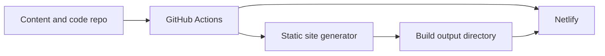
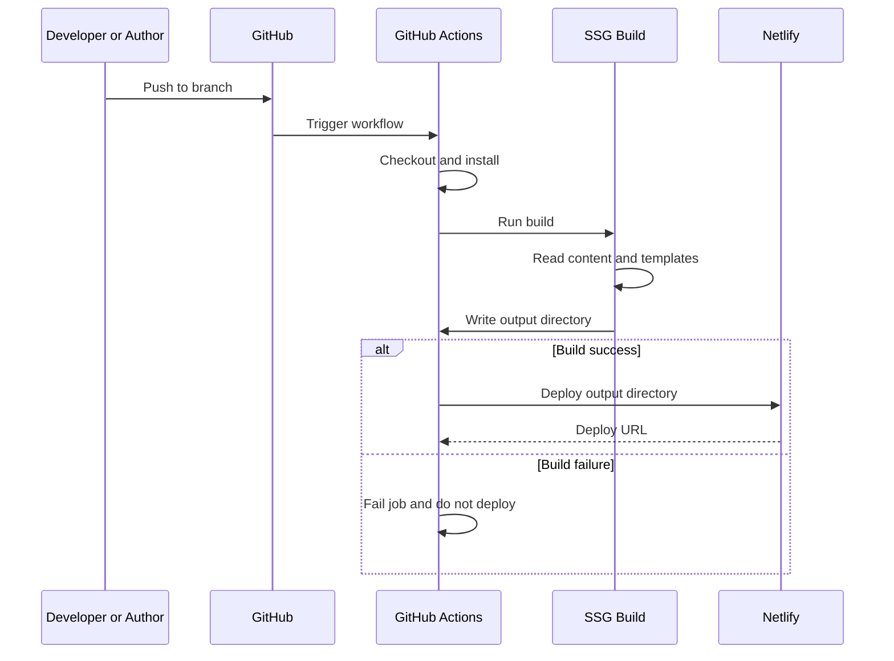

# Design Document

---
**Purpose**: Provide sufficient detail to ensure implementation consistency across different implementers, preventing interpretation drift.

**Approach**:
- Include essential sections that directly inform implementation decisions
- Omit optional sections unless critical to preventing implementation errors
- Match detail level to feature complexity
- Use diagrams and tables over lengthy prose
---

## Overview

This feature delivers a static blog that is built by GitHub Actions and deployed to Netlify. Content authors write posts in Markdown with optional front matter; the system produces a deployable static artifact and deploys it to Netlify on each successful build. Readers see a listing of posts and stable URLs for individual posts.

**Users**: Developers configure and maintain the pipeline; content authors create and update Markdown posts; readers consume the published site. **Impact**: Introduces a new pipeline (CI build + deploy), a content convention (post directory, front matter), and a hosting integration (Netlify).

### Goals

- Build orchestration via GitHub Actions and deployment to Netlify on push to the configured branch.
- Markdown-based posts with optional front matter (e.g. title, date, slug, draft); create/update by editing files.
- Post listing and per-post pages with stable URLs; Markdown rendered to HTML.
- Clear conventions for post location and static assets; Jekyll-like workflow without requiring Jekyll.
- Reproducible, configurable pipeline (secrets, branch, build command) documented and maintainable.

### Non-Goals

- CMS or in-browser editing; content is file-based only.
- Authentication or authorization for the public site; hosting is static.
- Netlify Functions or server-side logic; scope is static output only.
- Migration from an existing blog platform; greenfield only.

## Architecture

### Architecture Pattern & Boundary Map

The system follows a **linear pipeline** pattern: source (content + code) → build (SSG) → deploy (Netlify). Boundaries are: content/code in repository, build in CI, deploy as a single step to Netlify.

- **Selected pattern**: Pipeline (CI build + deploy). Rationale: requirements mandate GitHub Actions for build and Netlify as target; build runs in CI, deploy uploads artifact.
- **Domain boundaries**: (1) Repository — source of truth for content and site code; (2) Build pipeline — runs SSG and produces one output directory; (3) Deploy — uploads that directory to Netlify. No runtime server logic.
- **Steering compliance**: No existing steering; design establishes conventions for this greenfield feature.

### Technology Stack

| Layer                    | Choice / Version                | Role in Feature         | Notes                          |
| ------------------------ | ------------------------------- | ----------------------- | ------------------------------ |
| Frontend / CLI           | Static HTML/CSS/JS output       | Consumed by readers     | SSG produces static files only |
| Backend / Services       | None                            | —                       | No server-side application     |
| Data / Storage           | Git repository (Markdown files) | Content and site source | Versioned; no separate DB      |
| Messaging / Events       | GitHub push events              | Triggers workflow       | Configurable branch            |
| Infrastructure / Runtime | GitHub Actions, Netlify         | Build and host          | Secrets: token, site ID        |

### System Flows

Build and deploy flow (linear; no branching beyond pass/fail).

- **Key decisions**: Deploy step runs only after successful build; no deploy on failure. Single output directory; Netlify receives that directory as the site root.

## Requirements Traceability

| Requirement | Summary                                 | Components                     | Interfaces                | Flows                 |
| ----------- | --------------------------------------- | ------------------------------ | ------------------------- | --------------------- |
| 1.1         | Trigger build on push                   | Build pipeline                 | Workflow trigger config   | Build-deploy sequence |
| 1.2         | Produce static artifact                 | SSG                            | Output directory contract | Build step            |
| 1.3         | Deploy on success                       | Deploy adapter                 | Deploy contract           | Deploy step           |
| 1.4         | No deploy on failure                    | Build pipeline                 | Job success/failure       | Sequence alt          |
| 1.5         | GitHub Actions + Netlify                | Build pipeline, Deploy adapter | —                         | Full flow             |
| 2.1         | Markdown as post source                 | Content convention, SSG        | Content contract          | Build input           |
| 2.2         | Include new/updated posts in build      | SSG, Content convention        | Directory and pattern     | Build step            |
| 2.3         | Standard Markdown syntax                | SSG                            | —                         | Render                |
| 2.4         | Parse front matter                      | SSG, Content convention        | Front matter schema       | Build step            |
| 2.5         | Create/update by editing files          | Content convention             | Repo as source of truth   | Author workflow       |
| 3.1         | List posts                              | SSG, templates                 | Index/listing page        | Output structure      |
| 3.2         | Serve post by URL                       | SSG, Netlify                   | URL convention            | Request/response      |
| 3.3         | Render Markdown to HTML                 | SSG                            | —                         | Build step            |
| 3.4         | Stable URLs for posts                   | SSG, Content convention        | Permalink rule            | Output structure      |
| 4.1         | Convention for post location            | Content convention             | Directory and pattern     | —                     |
| 4.2         | Static assets in output                 | SSG, Content convention        | Asset directory           | Build step            |
| 4.3         | Jekyll-like workflow                    | SSG, Content convention        | —                         | Overall               |
| 5.1         | GitHub Actions runs build               | Build pipeline                 | Workflow definition       | Trigger and build     |
| 5.2         | Integrate with Netlify                  | Deploy adapter                 | Deploy contract           | Deploy step           |
| 5.3         | No manual invocation for normal updates | Build pipeline                 | Trigger on push           | Full flow             |

## Components and Interfaces

| Component          | Domain/Layer | Intent                                                    | Req Coverage                      | Key Dependencies        | Contracts            |
| ------------------ | ------------ | --------------------------------------------------------- | --------------------------------- | ----------------------- | -------------------- |
| Content convention | Content      | Define where posts and assets live and how they are named | 2.1, 2.2, 2.4, 2.5, 4.1, 4.2, 4.3 | —                       | State (documented)   |
| Build pipeline     | CI           | Run on push, run SSG build, run deploy on success         | 1.1, 1.4, 5.1, 5.3                | SSG (P0), Deploy (P0)   | Batch/Job            |
| SSG                | Build        | Turn Markdown + templates into static output              | 1.2, 2.1–2.5, 3.1–3.4, 4.2        | Content convention (P0) | Batch (input/output) |
| Deploy adapter     | CI           | Upload build output to Netlify                            | 1.3, 1.5, 5.2                     | Netlify (P0)            | Service (CLI/API)    |
| Netlify            | External     | Host static site and serve URLs                           | 1.3, 3.2, 5.2                     | —                       | External API         |

### Content / Convention

#### Content convention

| Field        | Detail                                                                                               |
| ------------ | ---------------------------------------------------------------------------------------------------- |
| Intent       | Define and document the location of post source files and static assets and the front matter schema. |
| Requirements | 2.1, 2.2, 2.4, 2.5, 4.1, 4.2, 4.3                                                                    |

**Responsibilities & Constraints**

- **Canonical structure** (implementation shall use unless overridden by config): post source files in `posts/` with file pattern `*.md`; static assets (images, CSS, JS) in `public/` (or `assets/`), copied or processed into the build output. Any override must be documented.
- Optional front matter schema: at least title, date, slug (or derived from filename), and optional draft flag; extensible for other metadata.
- One designated directory for static assets that must appear in the build output; convention for how SSG includes them (copy or process).

**Contracts**: State [x] — documented convention only; no runtime API.

**Implementation Notes**

- Front matter keys are implementation choices; design requires that the canonical directories (`posts/`, `public/` or `assets/`) and pattern be documented and stable so the SSG and pipeline can rely on them.

### Build / CI

#### Build pipeline

| Field        | Detail                                                                             |
| ------------ | ---------------------------------------------------------------------------------- |
| Intent       | Trigger on repository push, run SSG build, then run deploy only if build succeeds. |
| Requirements | 1.1, 1.4, 5.1, 5.3                                                                 |

**Responsibilities & Constraints**

- Trigger: push to a configured branch (e.g. `main`).
- Steps: checkout, install dependencies, run SSG build command, then invoke deploy with the single build-output path.
- If any step fails, subsequent steps (including deploy) are not run; build failure is visible in CI status.

**Dependencies**

- Inbound: GitHub (trigger and repo content).
- Outbound: SSG (build command), Deploy adapter (deploy call).
- External: None.

**Contracts**: Batch / Job [x].

##### Batch / Job Contract

- **Trigger**: Push to configured branch.
- **Input**: Repository contents (content + code).
- **Output**: Build success → one output directory path; build failure → no deploy, job failed.
- **Idempotency & recovery**: Re-run workflow (e.g. re-push or manual dispatch) produces a new build and deploy; no special recovery beyond CI retry.

##### Pipeline configuration

- **Trigger branch**: One configured branch (e.g. `main`); workflow runs on push to that branch. Production deploy is used when the workflow runs on this branch.
- **Required environment / secrets**: `NETLIFY_AUTH_TOKEN` (Netlify personal access token), `NETLIFY_SITE_ID` (Netlify site identifier). Both must be set as GitHub repository secrets; the deploy step receives them as environment variables. No other deploy-specific secrets are required by this design.
- **Build output path**: One directory path (e.g. `_site` or `dist`) produced by the SSG; the deploy step deploys this directory to Netlify.

**Implementation Notes**

- Workflow file location is implementation detail; design requires a single build output directory and a single deploy step consuming it, with the above configuration documented.

#### SSG (static site generator)

| Field        | Detail                                                                                                                       |
| ------------ | ---------------------------------------------------------------------------------------------------------------------------- |
| Intent       | Read posts and assets from designated paths, render Markdown (with front matter) to HTML, produce a static output directory. |
| Requirements | 1.2, 2.1, 2.2, 2.3, 2.4, 2.5, 3.1, 3.2, 3.3, 3.4, 4.2                                                                        |

**Responsibilities & Constraints**

- Input: post source directory (and pattern), asset directory, templates/layouts as defined by the chosen SSG.
- Output: one directory containing HTML, CSS, JS, and assets; index/listing page and per-post pages with stable URLs (e.g. slug- or date-based).
- Markdown: standard syntax; front matter parsed and available for rendering and listing (title, date, slug, draft, etc.). **Draft posts**: Posts with `draft: true` (or equivalent) shall be excluded from the build output — no HTML or asset for them shall be emitted — so that draft content is never deployed. Optional: a separate preview build may include drafts for author review.

**Dependencies**

- Inbound: Content convention (paths and schema).
- Outbound: Filesystem (write output directory).
- External: None.

**Contracts**: Batch [x] — input paths and output path are the contract; no API.

##### Batch Contract (SSG)

- **Trigger**: Invoked by build pipeline (e.g. `npm run build` or `npx eleventy`).
- **Input**: Content directory (posts), asset directory, templates; validated by SSG config.
- **Output**: Single directory tree (static files); root contains index and post pages and assets.
- **Idempotency**: Deterministic from source; re-run produces same output for same input.

**Implementation Notes**

- Eleventy is the recommended default; design is SSG-agnostic as long as the content convention and single output directory are satisfied. See `research.md` for rationale.

#### Deploy adapter

| Field        | Detail                                                                                          |
| ------------ | ----------------------------------------------------------------------------------------------- |
| Intent       | Upload the build output directory to Netlify so the site is live at the configured Netlify URL. |
| Requirements | 1.3, 1.5, 5.2                                                                                   |

**Responsibilities & Constraints**

- Input: path to build output directory; authentication (token) and site identifier (site ID); production vs draft is implementation (e.g. `--prod` for main branch).
- No transformation of the directory; upload as-is. Netlify serves the directory root as site root.

**Dependencies**

- Inbound: Build pipeline (output path and env).
- Outbound: Netlify (CLI or API).
- External: Netlify — deploy API or CLI (Criticality P0).

**Contracts**: Service [x] — deploy operation.

##### Service Interface

- **Operation**: Deploy(directoryPath: string, options: { production: boolean }): Result<DeployUrl, DeployError>
- **Preconditions**: directoryPath exists and contains static files; token and site ID available in environment.
- **Postconditions**: On success, Netlify serves the uploaded content; deploy URL returned or logged. On failure, no change to live site; error reported.
- **Invariants**: Only one directory path per deploy; no partial uploads in scope.

**Implementation Notes**

- Typically implemented via Netlify CLI (`netlify deploy --dir=... --prod`) in CI; token and site ID from GitHub secrets. See `research.md` for CLI and API references.

## Data Models

### Domain Model

- **Post (source)**: Content entity at design time. Attributes: body (Markdown), optional front matter (title, date, slug, draft, etc.). Identified by source file path or derived slug.
- **Build output**: Artifact — set of static files (HTML, CSS, JS, images, etc.) under one root directory. No separate domain entities; files are the unit of deployment.
- **Invariants**: Every post source file under the post directory and matching the pattern is considered for build; output directory is replaced entirely on each deploy (no incremental merge in design).

### Logical Data Model

**Content (source)**

- **Posts**: Files in post directory; pattern e.g. `*.md`. Attributes: filename, front matter (key-value), body (raw Markdown). No formal referential integrity; listing and URLs derived at build time.
- **Assets**: Files in asset directory; copied or processed into output; no schema beyond “files under this path.”

**Build output**

- **Structure**: Flat or hierarchical static files; at least index (listing) and one page per post; assets under a known path (e.g. `/assets/`). URL scheme (e.g. `/posts/slug/`) is implementation; design requires stability and shareability.

**Consistency**: Single-writer (build) produces output; deploy is atomic from the client’s perspective (Netlify’s atomic deploy behavior).

### Data Contracts & Integration

**Content contract (input to SSG)**

- Post: Markdown file with optional YAML (or equivalent) front matter. Minimum front matter: none required; recommended: title, date, slug or derivable from filename. Draft: optional boolean.
- Encoding: UTF-8; line endings are environment-dependent.

**Deploy contract (pipeline to Netlify)**

- Payload: directory of static files; no custom schema. Netlify accepts the directory and serves it; redirects/headers are optional and implementation-specific.

## Error Handling

### Error Strategy

- **Build failure**: SSG or install fails → workflow job fails; deploy step not run; failure visible in GitHub Actions. No automatic retry in design; user may re-push or re-run workflow.
- **Deploy failure**: Token invalid, site ID wrong, or Netlify unavailable → deploy step fails; build output is still produced. Fix secrets or Netlify config and re-run.
- **Content errors**: Invalid Markdown or front matter → handled by SSG; may fail build or skip file per SSG behavior; design does not prescribe.

### Error Categories and Responses

- **User/Config errors**: Missing or invalid secrets → CI logs should not echo secrets; message should indicate auth or site config failure. Invalid content → SSG errors with file/line where possible.
- **System errors**: Netlify API/CLI failure → fail the deploy step and surface error; no partial deploy. GitHub Actions unavailable → out of scope (platform).

### Monitoring

- Rely on GitHub Actions job status and logs for build and deploy. Optional: Netlify deploy notifications or status badges; not required by design.

## Testing Strategy

- **Unit**: (1) Front matter parsing and slug derivation for sample posts. (2) Template or listing logic that filters drafts or sorts by date, if applicable. (3) Any custom filters or shortcodes used by the SSG.
- **Integration**: (1) Full build from sample content directory to output directory; verify index and post pages and assets exist. (2) Deploy step in CI: run deploy with test directory or use Netlify’s test account; verify deploy completes and URL returns 200 (or run in dry-run if supported).
- **E2E**: (1) Push to branch → workflow runs → build succeeds → deploy succeeds; (2) Push that breaks build → workflow fails and no new deploy. (3) Reader: open listing page and one post URL; confirm content and stable URL.
- **Performance**: Optional; for static sites, build time and deploy time are the main metrics; no runtime performance targets in design.

## Supporting References

- Discovery and technology choices: `.kiro/specs/static-blog-netlify/research.md`
- Netlify CLI and API: see References in `research.md`
